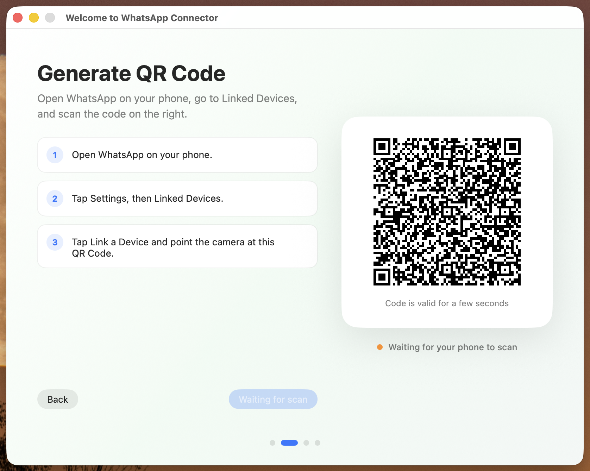
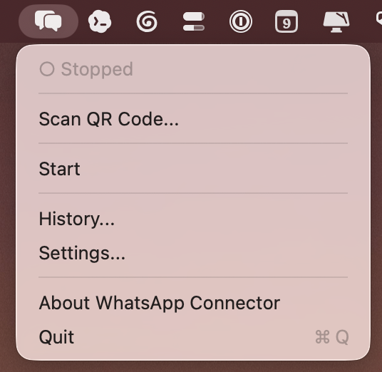

# WhatsApp Connector

Connect WhatsApp to Claude Code, Codex, and any MCP-compatible agent from a
native macOS menu bar app.

[Download WhatsApp Connector for macOS](https://github.com/raphaelcunha/whatsapp-connector/releases/download/v1.0/WhatsApp-Connector-1.0.dmg)



## Why WhatsApp Connector

WhatsApp is where real conversations already happen. WhatsApp Connector turns
that local WhatsApp session into a simple MCP bridge, so AI agents can help you
send messages, inspect conversation history, and work with WhatsApp from your
Mac without a manual terminal setup.

It is built for people who just want the connector to work: open the DMG, drag
the app to Applications, scan a QR Code, and use the menu bar icon.



## What You Get

- **One-click setup:** no manual pre-install steps for end users.
- **Native macOS experience:** runs quietly from the menu bar.
- **QR Code pairing:** connect WhatsApp using the same flow as Linked Devices.
- **Agent setup:** configure Claude Code, Codex, or another MCP client.
- **Conversation history:** browse chats grouped by room and export a chat when
  needed.
- **Simple controls:** start, stop, restart, view logs, generate a new QR Code,
  or repair the installation from Settings.
- **Private by default:** runtime data stays on your Mac.

## Install

1. [Download the DMG](https://github.com/raphaelcunha/whatsapp-connector/releases/download/v1.0/WhatsApp-Connector-1.0.dmg).
2. Open the DMG.
3. Drag **WhatsApp Connector** to **Applications**.
4. Open the app.
5. Follow onboarding and scan the QR Code with WhatsApp on your phone.

## No Pre-Install Needed

End users only need:

- macOS 14 or newer
- WhatsApp on their phone

If your Mac needs extra tools such as Xcode Command Line Tools, Homebrew, Go, or
uv, WhatsApp Connector installs them during onboarding.

## How It Works

WhatsApp Connector wraps the open source
[`lharries/whatsapp-mcp`](https://github.com/lharries/whatsapp-mcp) bridge in a
friendly macOS app.

The app prepares the bridge, links your WhatsApp session, starts a background
LaunchAgent, and registers the MCP server with the agent you choose.

## Works With

- Claude Code
- Codex
- Any MCP-compatible local agent

## Privacy

WhatsApp Connector does not add analytics, telemetry, remote logging, or a
hosted backend.

Runtime data stays on the user's Mac:

- WhatsApp bridge source and session data: `~/src/whatsapp-mcp`
- LaunchAgent plist: `~/Library/LaunchAgents/`
- Bridge logs: `~/Library/Logs/whatsapp-bridge.log`
- Bridge error logs: `~/Library/Logs/whatsapp-bridge.err.log`
- MCP client configuration, when selected by the user: `~/.claude.json` or
  `~/.codex/config.toml`

Do not publish WhatsApp messages, exported chats, session databases, local logs,
certificates, tokens, Apple signing data, or machine-specific configuration.

## For Developers

Developer requirements:

- Xcode Command Line Tools
- Homebrew
- `xcodegen`

Install the local build dependency:

```bash
brew install xcodegen
```

Build and run locally:

```bash
make dev-build
make run
```

`make dev-build` uses ad-hoc signing and does not require an Apple Developer
account.

## Signed Release

Set up notary credentials once per machine:

```bash
APPLE_ID=you@example.com TEAM_ID=ABCDE12345 NOTARY_PROFILE=WhatsAppConnector-notary make setup-signing
```

Build, sign, notarize, staple, and verify the DMG:

```bash
TEAM_ID=ABCDE12345 BUNDLE_ID=app.whatsappconnector.mac NOTARY_PROFILE=WhatsAppConnector-notary make release
```

The release script writes generated output to `dist/`. Public downloadable
builds can be copied to `releases/`.

## Project Layout

```text
WhatsAppConnector/
├── project.yml
├── Makefile
├── Sources/WhatsAppConnector/
├── Resources/
├── releases/
│   └── WhatsApp-Connector-1.0.dmg
└── scripts/
```

## Cleanup

Remove generated local artifacts:

```bash
make clean
```

Uninstall the runtime bridge from a Mac:

```bash
launchctl unload ~/Library/LaunchAgents/com.${USER}.whatsapp-bridge.plist
rm -f ~/Library/LaunchAgents/com.${USER}.whatsapp-bridge.plist
rm -rf ~/src/whatsapp-mcp
rm -rf "/Applications/WhatsApp Connector.app"
```

Then remove any `whatsapp` MCP entry from the MCP client configuration you used.

## Security

Please see [SECURITY.md](SECURITY.md).

## License

MIT. See [LICENSE](LICENSE).
